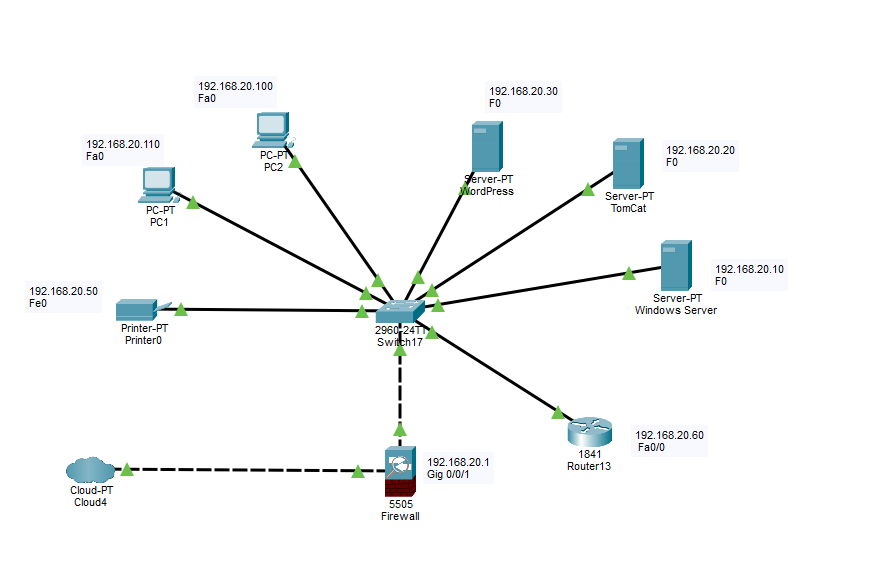
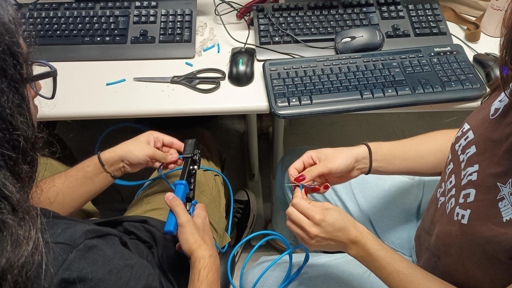

# Projeto Integrador - Implantação de Infraestrutura de TI

**Empresa:** Zetta

**Slogan:** Soluções tecnológicas e suporte em TI.

  

Alunos: Nicolas, Anna, Rafael, Sara, Gabriel M., Levy.

---

## 📝 Sobre a Empresa

### Missão
Nossa missão é alinhar processos, blindar servidores e garantir o fluxo contínuo de dados, entregando um suporte em TI tão fluido, inteligente e sob medida que se torna invisível no dia a dia dos nossos parceiros.

### Visão
Ser a principal referência em terceirização e infraestrutura de TI para empresas prestadoras de serviços, alcançando a marca de 100% de disponibilidade dos ambientes gerenciados e expandindo nossa operação com soluções automatizadas e alta retenção de clientes.

### Organograma Simplificado

* **Diretoria:** CEO e CTO
* **Administrativo / Financeiro:** RH e Faturamento
* **Recepção:** Atendimento Inicial e Triagem
* **Suporte Técnico / Operações:** Analistas de Infraestrutura, Redes e Helpdesk

**Quantidade de Funcionários:** 15 colaboradores.

### Planta Baixa do Escritório

  

---

## 👥 Integrantes do Grupo e Funções (Kanban)

* **[Nicolas e Anna]** - Scrum Master & Sysadmin Windows (Active Directory, DNS, DHCP e GPOs).
* **[Gabriel Monteiro e Sara]** - Sysadmin Linux & DevOps (Servidor Web Apache/Nginx, Banco de Dados e GLPI).
* **[Rafael e Levy]** - Engenheiro de Redes (Topologias e Configurações no Cisco Packet Tracer).

---

## 🛠️ Projeto de Rede (Cisco Packet Tracer)

A rede está estruturada na subrede **192.168.20.0/24** para organizar os ativos de forma estática e as estações de trabalho via DHCP.

<h3 align="center">🌐 Topologia Lógica da Rede</h3>

  

### Plano de Endereçamento IP

| Equipamento / Serviço | Endereço IP | Interface | Função no Projeto |
| :--- | :--- | :--- | :--- |
| **Gateway / Firewall** | `192.168.20.1` | Gig0/0/1 | Roteamento de borda e segurança |
| **Windows Server (AD/DNS)** | `192.168.20.10` | FE0 | Controlador de Domínio e escopo DHCP |
| **Linux Server (GLPI)** | `192.168.20.20` | FE0 | Sistema de chamados técnicos |
| **Linux Server (Web/Wiki)** | `192.168.20.30` | FE0 | Aplicação Web Corporativa |
| **Impressora de Rede** | `192.168.20.50` | FE0 | Impressora compartilhada do escritório |
| **Access Point (Wi-Fi)** | `192.168.20.60` | Port 0 | Distribuição de sinal sem fio (SSID: HairHiTech_Corp) |
| **Estações de Trabalho** | DHCP | FE0 / Dynamic | IPs distribuídos do `.100` ao `.200` |

---

### Topologia Lógica do Cenário

  

---

## 📂 Estrutura de Pastas do Repositório

* `/packet-tracer`: Arquivos `Topologia Zetta.pkt` das topologias física e lógica.
* `/documentacao`: Planta baixa do escritório, relatórios e atas de reuniões.
* `/scripts`: Scripts de automação ou arquivos de configuração dos servidores (Windows/Linux).

---

## 📸 Galeria de Implementação Física e Fases do Projeto

Abaixo está o registro cronológico das etapas de montagem, configuração e testes da nossa infraestrutura real.

---

### 🧱 Fase 1: Infraestrutura Física e Cabeamento
*Nesta etapa, realizamos a identificação dos equipamentos de hardware, montagem dos racks e a confecção/crimpagem dos cabos de rede Cat.6 para interligar os computadores.*

  
  

---

### 💿 Fase 2: Instalação de Sistemas e Provisionamento
*Instalação dos Sistemas Operacionais nas máquinas físicas. Configuração do ambiente de testes e carregamento de drivers específicos (como Intel RST) para o perfeito reconhecimento e desempenho dos SSDs e storages.*

  
  

---

### 🔑 Fase 3: Configuração dos Serviços de Rede
*Momento em que os Sysadmins e Engenheiros de Rede colocaram a inteligência do projeto para rodar: criação do Controlador de Domínio no Windows Server, subida das diretivas (GPOs), escopo DHCP ativo e inicialização dos servidores Linux (GLPI e Web).*

  
  

---

### 🧪 Fase 4: Testes de Conectividade e Homologação
*Validação final de que tudo funciona de verdade no mundo real. Telas comprovando o recebimento de IPs automáticos pelas estações de trabalho, testes de ping e o funcionamento do Firewall de borda isolando a rede.*

  
  

